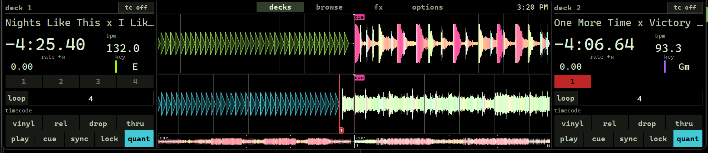

# Terminal-wide

A Mixxx skin for the appliance's 8.8" **1920×480** ultrawide touchscreen.



## What it is

Two decks flanking the waveforms:

```
┌────────────────┬─────────────────────────────┬────────────────┐
│ deck 1  tc ok  │ decks browse fx options     │ deck 2  tc ok  │
│ title          ├─────────────────────────────┤ title          │
│ -4:25.40 ▛bpm 132▜│ deck 1 waveform          │ -4:06.64 ▛bpm 93▜│
│ rate ±8    key  ├────────────────────────────┤ rate ±8    key   │
│ 1  2  3  4     │  deck 2 waveform            │ 1  2  3  4     │
│ loop 4  ◀ 4 ▶  │                             │ loop 4  ◀ 4 ▶  │
│ timecode       ├──────────────┬──────────────┤ timecode       │
│ vinyl rel drop │ overview     │ overview     │ vinyl rel drop │
│ play cue sync  │              │              │ play cue sync  │
└────────────────┴──────────────┴──────────────┴────────────────┘
```

The tab bar runs only the width of the waveform column. Across the whole window
it cost the deck columns 34px of height, and the tabs have nothing to do with
the decks anyway. It is one widget that moves: a singleton, sitting inside
whichever page is showing, full width on the two pages that are full width.

The tabs are centred in it rather than left-aligned, and the clock at the right
is balanced by an equal spacer at the left. Both bars then share a centre line —
the deck columns are the same width as each other — so a tab stays under your
finger when you switch pages instead of jumping.

An ultrawide has width and almost no height, so the deck state goes *beside* the
waveforms instead of under them. The deck column is 400px by default and
adjustable from 360 to 600 on the options page — wide enough for a 42px-tall
button row with finger-sized targets, which is the whole reason for that range.

**Time and bpm share a row, and there is no artist or track length.** Those two
numbers are read together while beat-matching, so they belong in one glance.
Time keeps the left and whatever width is left over; bpm is a fixed 128px box,
since it is five characters whatever happens.

**The bpm block is boxed and in reverse video** — a filled box with the ink
knocked out of it, with its caption beside the number rather than over it. It is
the one number on the deck that decides what happens in the next few seconds, so
it is the single exception to this skin's rule that a full accent fill means an
*engaged control*. Putting the caption to the side rather than above also gave
the number the whole box height, and with it a size the stacked version could
not afford.

The deck shows time *remaining* only — no elapsed, no length. With a platter
driving playback that is the only one of the three that changes what you do
next, and dropping the other two is what lets it be 46px instead of 29px while
still sharing its row. The title identifies the track across the booth on its
own; the artist row it replaced was worth more as title size.

## Defaults vs overrides

**The skin sets no preference on your behalf.** It used to: the time display and
the effect routing were `persist="false"` attributes, which is the only form of
skin attribute that reliably reaches a control Mixxx has already created — and
which therefore re-asserts itself on *every* launch, undoing whatever the
operator last chose. Routing you changed with the fx page's route buttons came
back wrong after a restart, and so did the time display.

Those are seeded into `mixxx.cfg` instead, and only where the config has nothing
to say yet, so they are defaults rather than overrides:

| Key | Seeded | Why |
|---|---|---|
| `[Controls] PositionDisplay` | 1 (remaining) | the deck's time field is sized for seven cells; "both" overflows it |
| `[EffectRack1_EffectUnit1] group_[Channel1]_enable` | 1 | unit 1 on deck 1 |
| `[EffectRack1_EffectUnit2] group_[Channel2]_enable` | 1 | unit 2 on deck 2 |

[`scripts/preview-terminal-wide.ps1`](../../../scripts/preview-terminal-wide.ps1)
does the seeding for the preview; appliance provisioning should ship the same
values in its `mixxx.cfg`.

The skin's own options — everything on the options page — are `[TerminalWide]`
and `[Skin]` controls declared `persist="true"`, which Mixxx writes back to the
config. They persist already.

One thing that defeats all of it: **Mixxx writes `mixxx.cfg` on a clean exit and
nowhere else.** Kill the process and every preference and option changed since
launch is gone, which looks exactly like nothing persisting. The preview script
closes a running instance with `WM_CLOSE` and waits for it rather than killing
it, for that reason.

**There is no mixer and there are no level meters.** The DJM-T1 does gain, EQ,
faders, crossfader and headphone cueing in analogue ([ADR-003](../../../docs/decisions.md));
putting them on screen too would only split the operator's attention. What is on
screen is what the hardware cannot report: which track is loaded, how much is
left, what tempo the platter is really running at, and whether Mixxx is locked
onto the timecode.

## Pages

**decks** — the mixing page above.

**browse** — search line over the tree and the track table, full screen.
Browsing is the dominant touch interaction here, so it gets the whole panel
rather than a strip.

**fx** — both effect units, side by side, with everything each one has:
routing, the unit enable, mix mode, dry/wet and super knobs, a chain preset
selector and its menu, and three slots each with its own enable, effect
selector, meta knob and parameters.

Effects were tried first as narrow columns flanking the decks. The columns had
room for the three selectors and nothing else, so they became a page — where
nothing competes with the decks for the 480 rows the panel has. Unit 1 on deck
1 and unit 2 on deck 2 is the appliance's default, seeded into a fresh config
by `scripts/preview-terminal-wide.ps1` rather than asserted by the skin: a skin
attribute that sets a value every launch is not a default, it is an override of
whatever the operator last chose. The route buttons change it live.

**Time and tempo.** Time and bpm share a row, key and rate the next, and the
two right-hand boxes line up: bpm over rate, because the bpm you are reading is
the bpm that rate produced. Neither of the lower two has a caption - "key" over
a value that reads 6A is a label for someone who has never seen a deck before -
and the rate's window rides on its own line as "0.00 +-8", which is the piece
that makes the number mean something. The captions were costing a line the
panel did not have to spare, and their absence is what lets all of it fit
without the row above clipping into it.

The key reads from the left, under the time, which needs the second-smallest
patch on the `terminal-skin` branch: with key colours on, upstream `WKey` paints
its own text with a hard-coded `Qt::AlignCenter` and ignores both `<Alignment>`
and the stylesheet. Without that patch the key sits centred in its half of the
row - wrong but harmless.

**Loop and beatjump.** Both lengths are readouts - the controller sets them -
so they are filled boxes with the ink knocked out, each in its family's hue:
loop yellow, beatjump magenta on the Btop palette, and the scheme's one hue on
the phosphor palettes. A sunken box with a border, which is what they were,
reads as a field you are meant to type in. The hue also says which of the two
you are looking at before you have read the number.

The loop toggle carries a glyph rather than the word: two parallel runs with an
arrow at each end, which is a rectangle like everything else in this skin and
closer to what a loop over a track is - out to the end, back to the start,
along the same stretch - than a circle is. The three marks on the row are set
at 46px and 32px against the row's 20px lettering, which looks wrong written
down and is right on the panel: an arrow glyph carries perhaps a third of the
ink a letter of the same point size does, so sizing it by the number gives a
mark half the weight of the words around it.

**Overview placement.** Three: in the centre column under the waveform lanes,
inside each deck column, or a full-width row under the whole page with deck 1
on the left half and deck 2 on the right. The last is the widest a whole track
can be drawn on this panel, and the only placement where the two overviews are
the same width as each other. The overviews are singletons, so they are in one
of the three places, never two.

## FX parameters

Each slot lays out all eight knob parameters *and* all eight button parameters,
and each one hides itself unless the loaded effect actually has it — so a slot
shows exactly what its effect offers. Tremolo, for instance, comes up as two
switches (`quantize`, `triplet`) and five knobs (`depth`, `rate`, `width`,
`waveform`, `phase`).

That hiding is the skin's job, not Mixxx's. Nothing about a parameter widget
makes it disappear when its parameter is absent — it renders inert with an
empty name, which is why wiring only the first three knobs left an effect with
more of them showing knobs that were not there to adjust, and why the switches
never appeared at all. Every parameter slot does publish
`<group>,parameter<n>_loaded` and `<group>,button_parameter<n>_loaded`
(`effectknobparameterslot.h` / `effectbuttonparameterslot.h`,
`formatItemPrefix`), and binding visibility to those is the handle.

A parameter knob needs **both** wirings, and they do different jobs. The
`EffectUnitGroup` / `Effect` / `EffectParameter` trio tells the widget which
parameter it is *showing*; a `<Connection>` to
`<slot>,parameter<n>` is what gives it a control to *write*. With only the
first, the knob draws the right value and moves nothing — which is what it did
here at first.

Knobs adjust by dragging vertically, not by tapping — that is Mixxx's
`WKnobComposed` behaviour and not something the skin sets. Worth knowing on a
touchscreen: a tap on a knob is a no-op by design.

The knobs are arcs with no image behind them. `WKnobComposed` draws the value
arc on its own when `ArcRadius` is set and no pixmap is given
(`wknobcomposed.cpp`, `paintEvent`), which is what lets this skin go on
shipping no assets at all. The arc is centred on the widget at `ArcRadius`, so
the knob has to be at least `2 × ArcRadius + ArcThickness` in both directions —
20 and 5 wanted 45px out of a 44px knob, which is exactly the sliver that was
being clipped off.

## FX chain presets

The header of each unit carries a chain preset selector and, beside it, the
menu button. Between them they cover both directions: the selector recalls -
pick a preset and the whole unit, all three slots and their parameters, loads
from it - and the menu saves, with `Update Preset` over the loaded one,
`Save As New Preset...` for a new one, `Delete Preset` for one you are done
with, and a `Save snapshot` per slot for a single effect's settings. The five
presets Mixxx ships (`res/effects/chains`) are in both lists from the first
launch.

`Delete Preset` is the one item here that upstream's menu does not have - it
needs the core patch described in `docs/skins.md`. Deleting is permanent: the
shipped presets are copied into your settings directory on first run and are
ordinary files after that, so deleting one of those deletes it for good too
(Preferences -> Effects -> Import brings it back from `res/effects/chains`).

Each unit gets its own pair, so a preset can be recalled into either one; which
unit a widget belongs to is the single `<EffectUnit>` value already passed down
`fx_unit.xml`, which is all `EffectWidgetUtils::getEffectChainFromNode` reads.

The selector sits empty until a preset is loaded - an empty box means the chain
is something you built by hand, not that nothing is loaded.

Two things about this on the appliance. The menu button has no text of its own -
`WEffectChainPresetButton` takes none from the skin - so the stylesheet centres
its menu indicator and lets the arrow be the glyph, which is why this feature
still ships no image assets. And `Save As New Preset...` and `Rename Preset`
open a name-entry dialog: recall, `Update Preset` and the snapshots all work
with a finger alone, but naming a new preset needs a keyboard, or the on-screen
one from the `search-osk` patch in `docs/skins.md`.

**options** — everything that is a setting rather than a performance control:

| Setting | Values | Default |
|---|---|---|
| waveform lanes | two rows / two columns | two rows |
| deck column width | 360 … 600 px in 40s | 400 px |
| track overview | under waveform / in each deck / full width | under waveform |
| overview height | 24 / 36 / 52 / 72 px, either placement | 36 px |
| hot cues | hidden / 4 / 8 | 4 |
| loop | hidden / shown | shown |
| beatjump | hidden / shown | hidden |
| dvs controls | hidden / shown | shown |
| intro & outro markers | hidden / shown | shown |

New settings go here, not in the toolbar. The toolbar has room for about three
controls before it stops being a status line, and less than that now that it
runs only the width of the waveform column; this page has most of a 1920×480
panel spare.

Each row is a caption and one cycling button, and the button's label *is* the
readout — no radio groups, one 44px target per setting.

The layout settings drive struts on the decks page rather than resizing
anything directly: four zero-height `WidgetGroup`s of fixed widths, of which
exactly one is visible, set the deck column's width, and the same trick with
fixed heights sets the overview row's. Qt drops a hidden widget from its
parent's layout entirely, so the one visible strut alone sets the size. A
`WidgetStack` reads better and does not work here: its `sizeHint` is the
current page's own `sizeHint`, and a size set through `<Size>` is a min/max
constraint that never reaches `sizeHint`, so every page measures zero.

## Waveform lanes: rows or columns

The *waveform lanes* setting switches the centre column between

- **rows** — two full-width lanes stacked, so the beat grids line up under each
  other. The default, and the better one for beat-matching by eye.
- **cols** — one lane per deck side by side, each half as wide and twice as
  tall. Better for reading a track's structure at a glance.

In **cols** the waveform itself is turned: time runs down the lane, the beat
grid is horizontal, and the playhead is a horizontal line. That needs the
rotation patch on this build's Mixxx branch — see *Requires* below. Upstream
Mixxx parses `<Orientation>vertical</Orientation>` and hands it to the
renderer, but its allshader backend never turns the scene, so the signal comes
out squeezed into `height` pixels of `width` and sitting off its axis.

A layout cannot be rebuilt at runtime, so both arrangements are built at load
and a `WidgetStack` shows one. That means four waveform widgets for two decks;
`WaveformWidgetFactory` skips the ones that are not visible, so the hidden pair
costs nothing per frame.

## Deck rows

Under the tempo readouts, three rows the options page turns on and off:

- **hot cues** — one row of four, two rows of eight, or none. A set cue shows
  the colour the cue itself carries, unless the scheme is monochrome and has
  switched that off. A cue whose stored colour is black — common on tracks
  carrying imported Serato or rekordbox markers — therefore paints black on a
  black ground on a multi-hue scheme. That is the track's data, not the skin.
- **loop length** and **beatjump length** share one row: `loop · 4 · ◀ · 4 · ▶`.
  Beatjump is off by default — with turntables doing the playing it is the
  least-used, and the panel is 480px tall. With both off the row collapses
  rather than leaving a gap.

Each length carries only the control the number does not already imply. The
loop gets one engage/disengage toggle, which doubles as the indicator of
whether a loop is running and costs less width than a caption would; the jump
gets its two directions, one either side of its number. Halving, doubling and
setting a loop from scratch are on the DJM-T1's own buttons.

The length itself is a `BeatSpinBox`, which is what gives `1/8` and `0.5` the
same treatment as `32`, with its steppers sized away in the stylesheet — the
number is a readout, and a stepper would be one more thing to press.

The loop toggle fires `beatloop_activate` on its left button and takes its
state from `loop_enabled` on a second, display-only connection. Order matters:
the last connection that reads back into the widget is the one that drives the
rendered state.

## DVS

Each deck carries the four vinyl-control widgets:

| Widget | Control | Notes |
|---|---|---|
| `tc off/ok/warn/err` | `vinylcontrol_status` | read-only, no control to write to |
| `vinyl` | `vinylcontrol_enabled` | |
| `abs / rel / const` | `vinylcontrol_mode` | a selector, so no state is "engaged" |
| `drop / cue / hot` | `vinylcontrol_cueing` | what a needle drop does |
| `thru` | `passthrough` | analogue straight past Mixxx |

[Pioneered-DVS](../Pioneered-DVS/README.DVS.md) deliberately kept the controls
*off* screen — at 1024px the deck row had no room, so the rule there was
"controls on hardware, state on screen". 1920px of width buys the room back, and
having the mode switches next to the deck they belong to is worth it. They stay
bound to the same controls as the DJM-T1's own buttons in
[`Pioneer-DJM-T1-DVS.midi.xml`](../../controllers/Pioneer-DJM-T1-DVS.midi.xml),
so either surface works and both show the same state.

The status widget reports `[ChannelN],vinylcontrol_status`, whose values are
defined in Mixxx's `src/vinylcontrol/defs_vinylcontrol.h`:

| Value | Shown | Treatment |
|---|---|---|
| 0 | `tc off` | dark block, faint text |
| 1 | `tc ok` | outlined in the accent |
| 2 | `tc warn` | dim fill |
| 3 | `tc err` | full reverse video |

Each state is a different *treatment*, not just a different colour, because on a
monochrome scheme hue cannot carry it. On Btop they separate by hue as well.

## Colour schemes

Four, all generated from one palette each:

| Scheme | Palette |
|---|---|
| Btop | black ground, sage-grey rules, four hues |
| Amber | P3 amber phosphor, one hue |
| Green Phosphor | P1 green phosphor, one hue |
| White Phosphor | one hue |

**The skin is generated, not hand-edited.** `style_<scheme>.qss`, the
`<Schemes>` block in `skin.xml` and `library/<scheme>/` all come from
[`tools/terminal_wide/generate.py`](../../../tools/terminal_wide/). Edit a
palette or a template and re-run it; edits made directly to those files are
overwritten. `style.qss` and the widget XML *are* hand-written — they carry
geometry and type and no colour at all.

## Requires

The skin loads on stock Mixxx 2.5+, but four things degrade without the core
changes on the `terminal-skin` branch:

- **vertical waveforms** — the *two columns* lane arrangement needs the
  rendergraph rotation. Without it the lanes still lay out side by side, but
  each one's signal renders wrong. Stay on *two rows* on a stock build.

- `<UseCueColor>` — without it, hotcue markers keep the user's palette colours,
  so a monochrome scheme gets one stray coloured marker.
- `<TrackTableBackgroundColorOpacity>` — same, for the track-colour wash over a
  library row.
- `library/<scheme>/ic_library_*.svg` overrides — without them the sidebar keeps
  Mixxx's built-in orange icons, which on a green-phosphor screen are the only
  colour on it.

Only the first of those is a functional loss; for the rest nothing fails to
load, the monochrome schemes are just not quite monochrome.

Library row height and font size are Mixxx *preferences*
(`[Library],RowHeight`, `[Library],Font`), not skin settings. On the panel they
want turning up, and the skin cannot do it without overwriting the user's
choice on every launch.

## Installing

Copy or symlink this directory into Mixxx's skins path:

```bash
ln -s "$PWD/mixxx/skins/Terminal-wide" ~/.mixxx/skins/Terminal-wide
```

Then pick **Terminal-wide** in Preferences → Interface, and a scheme beside it.

## Verified / not verified

**Verified** at 1920×480 against Mixxx `main` + the `terminal-skin` branch, with
two tracks loaded, using `_localbuild/skinshot.ps1` in the Mixxx tree: the skin
loads with no skin-parse warnings in any of the four schemes; the browse page,
the sidebar icon overrides and the monochrome waveform colours all follow the
palette; and each option was exercised by clicking it and re-rendering —
both lane arrangements (including the turned waveform, beat grid and playhead
in columns), all four deck widths, the overview in both places, and the tall
overview row.

**Not verified:** the `ok` / `warn` / `err` timecode states. Those need a real
timecode signal, so they are confirmed by construction only — the QSS selectors
follow the same `displayValue` pattern as the rest of the skin, but nothing has
exercised states 1–3. Same caveat Pioneered-DVS carries.

## Licence

This skin's design derives from **Terminal**, which derives from **LateNight**
by jus, Owen Williams and ronso0, licensed
[CC-BY-SA 3.0 Unported](http://creativecommons.org/licenses/by-sa/3.0/).
Terminal-wide keeps that licence — *not* the MIT licence that covers the rest of
this repository, and not the GPL-3.0 that covers the sibling `Pioneered-DVS`
directory.

The layout is original. It takes its touch sizing and its tabbed page model as
reference from [Pioneered](https://github.com/timewasternl/Pioneered) by Sven
Boekelder (GPL-3.0) — see [docs/skins.md](../../../docs/skins.md) for why that
skin was the starting point — but carries none of its markup, so no GPL-3.0
obligation attaches here.

The `library/` icons are Mixxx's own sidebar icons, flattened and repainted by
the Terminal generator.
